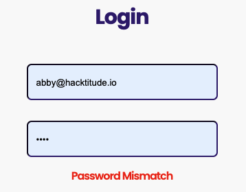
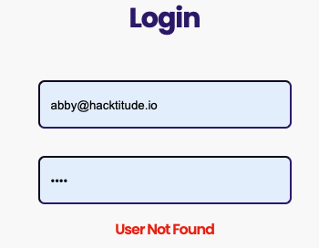
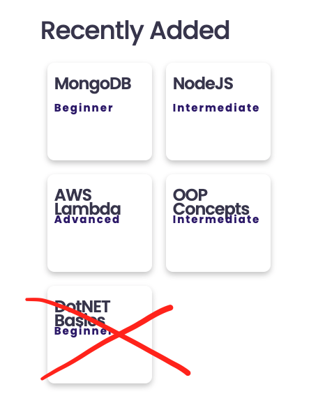
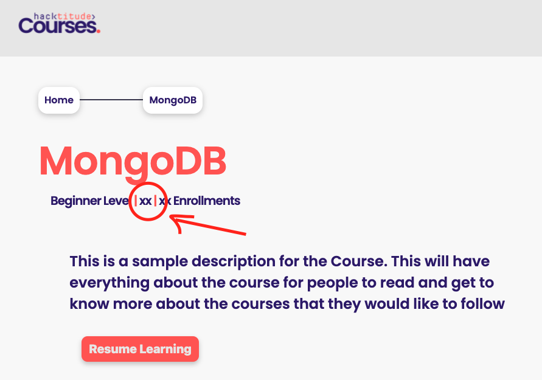

[<< home](./README.md)

# Challenge 0

## Challenge 0.a

In the current application, you may have noticed that at incorrect `login` attempts,  the system exposes too much information. For example, current the system displays below messages on following 2 scenarios.

| Scenario      |  |
| ----------- | ----------- |
| If user email does exists but the password is incorrect, system shows the message `Password Mismatch`      |        |
| If user email is not existing, system shows message `User Not Found`   |          |

This is a bad security practice, as hackers will be able to verify if an user account is existing by simply testing around the system. Your task is to fix this by ensuring in 'both' above scenarios, the system shows the exact same message `User authentication failed`.

Once this task is complete, two tests in `challenge-0.test` should succeed. You can verify that by running the the command `npm test challenge-0`.

## Challenge 0.b

When an user login to the system, you may notice that `Recently Added` courses are shown on the right side of the `home` page. Currently there are 5 courses shown. as shown below:

However having 5 courses on 2 columns does not look good visually. Your task is to show only 4 courses instead of 5 shown currently.

Once this task is complete, one test in `challenge-0.test` should succeed. You can verify that by running the the command `npm test challenge-0`.

## Challenge 0.c

In course details view you should show the learning duration of the course.

To implement this, you will have to add a new column named `duration` to the `courses` database table. This column should be able to store a `string` value; for example `20 hours`, `3 weeks`, etc.

* Since the database is auto generated, you will need to change the migration file `db/migratons/20211229064226_db_migrations.js` to add `duration` column to `courses`.
  * After the change is done, delete the sqlite database file `main.sqlite`.
  * Now run following command to recreate the development database `npm run migrate`

>> (optional) A more accurate way to handle migrations is to create a new knex migration file, and do the schema change (column addition) within that new migration file.

* To add durations to currently available courses in the database, you may need to modify seed data. This can be done by changing the insert statement in `db/seeds/courses.js` to insert some data to the newly added `duration`column. Now run following to populate seed data into development database.
  * npm run seed

Once DB schema changes are done, you need to modify the repository, service and view layers in code as required to show course duration in the course details page (Course Dashboard). There is a span element with id `course-duration` in `course-dashboard.ejs`. You should show the course duration which you retrieve from the database within this span element.

Once this task is complete, two tests in `challenge-0.test` should succeed. You can verify that by running the the command `npm test challenge-0`.
