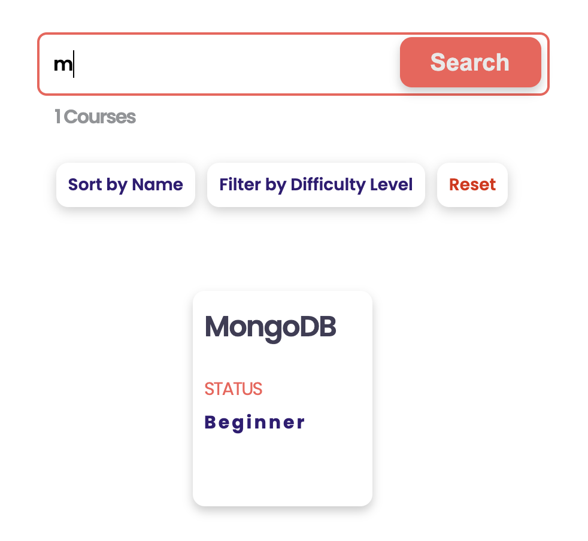
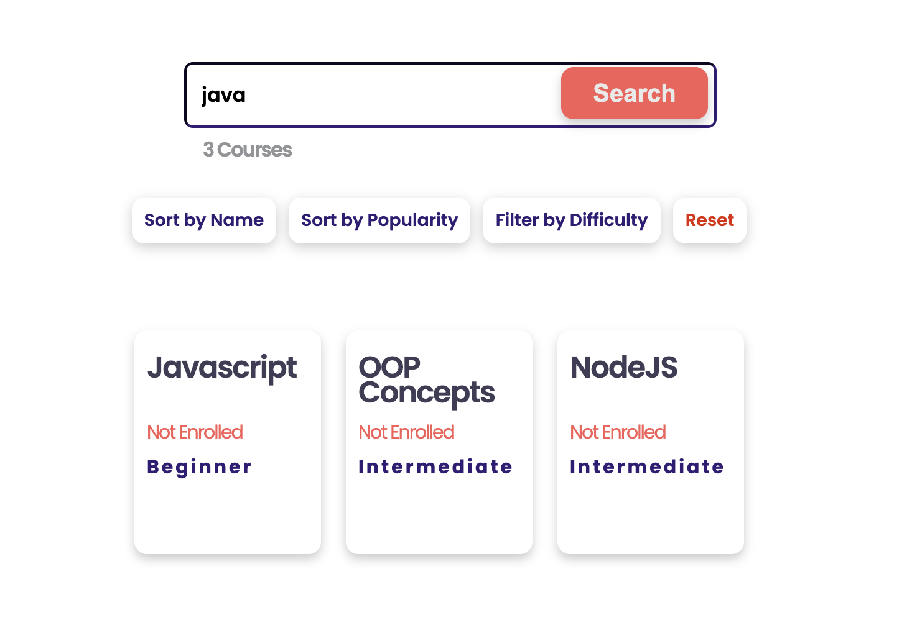

[<< home](./README.md)

# Challenge 1

## Challenge 1.a [1 Point]

Currently, the search functionality in the `All Courses` page return courses where the search term is at the `beginning` of the course name.

E.g. IF you search with term 'm' it only returns 'MongoDB' course as shown below.

Your task is to improve this functionality, so that search returns courses having the search term **anywhere** (not just at the beginning) in the `course name` or `course description`.

E.g. IF you search with search term 'java' it should returns all courses which has the term 'java' anywhere in its title or description as below.

Once this task is complete 1 test case in `challenge-1.test.js` will pass.
