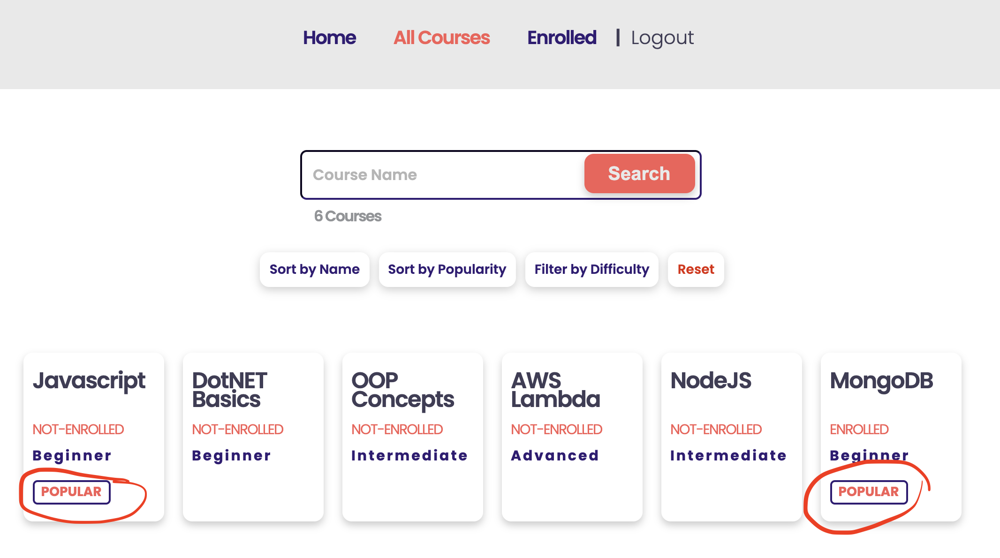

[<< home](./README.md)

# Challenge 10

The course popularity is measured by the number of users enrolled to  course. Higher the enrollments, more popular the course is. In case, more than one course have the same number of enrollments, those should be ordered alphabetically in ascending order.

## Challenge 10.a [4 Points]

In `all courses` page you should add a tag 'POPULAR' on most popular courses as shown above.

'POPULAR' tag should only appear on the most popular 20% of the courses.

* e.g. If there are 6 courses available in total, the 2 most popular courses should be tagged as 'POPULAR'.
  * i.e Round_Up_To_Nearest_Integer(6 * 0.2) = 2

* e.g. If there are 13 courses available in total, the 3 most popular courses should be tagged.
  * i.e. Round_Up_To_Nearest_Integer(13 * 0.2) = 3

>>TIP: Please note that you should ROUND **UP** (Round Upwards) to the nearest integer.

>> NOTE: The text 'POPULAR' should not appear in the HTML DOM for non popular courses. This means you have to render this 'POPULAR' HTML tag from EJS server code. Setting visibility true/false on client side JavaScript will not work.
