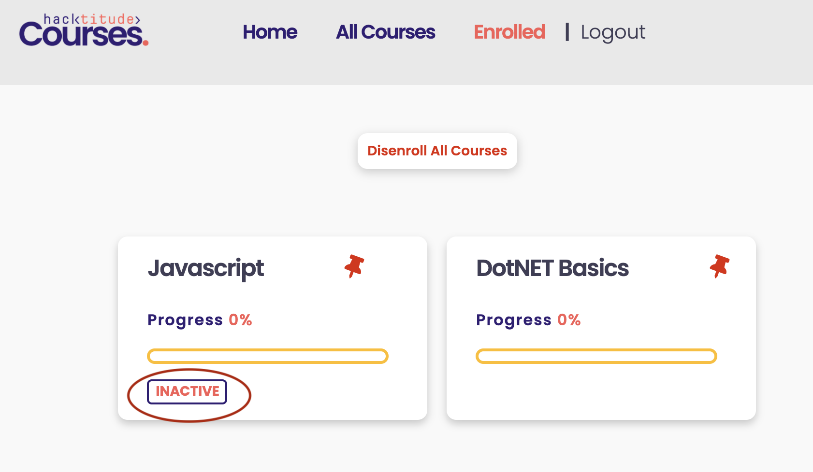
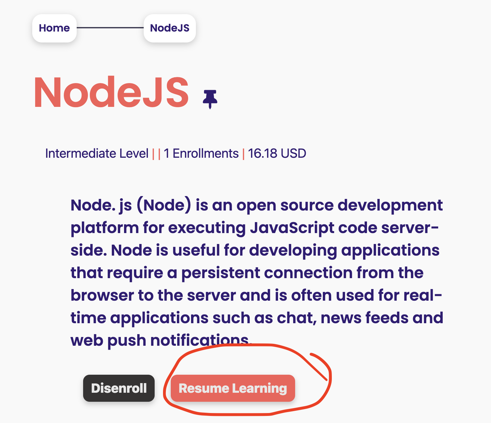

[<< home](./README.md)

# Challenge 11

Currently in the system there is no mechanism to remind users of `inactive` courses. Inactive are the courses user is enrolled to, but not visited (resumed) for 14 days or more.

## Challenge 11.a [1 Point]

Currently the `last resumed` date of a course is not captured when someone visits a course, Therefore, you have to create a new column in `userCourses` table called `last_resumed_date` to capture this. This column should be able to accept `date` datatype.

>>NOTE: DB changes should be only done through `migrate` files.

>> In the migrations you may use `table.date("last_resumed_date")'` to create this column when creating `userCourses` table.

After enrolling in a course, when a user clicks on the `Resume Learning` button, the current date should be updated to this new `last_resumed_date` column.

## Challenge 11.b [4 Points]

The `
` tag which is in the `enrolled.ejs` with the id starting with `inactive-` should only be rendered if the current date is more than or equal to 14 days since the last resumed date.

>>NOTE: To make it invisible, do NOT use client side JavaScript such as`style='display: none;'`. But use EJS server scripts to not render the `
` tag.

