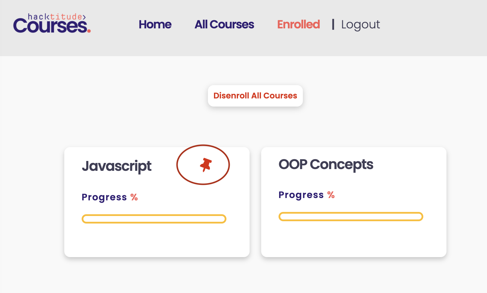
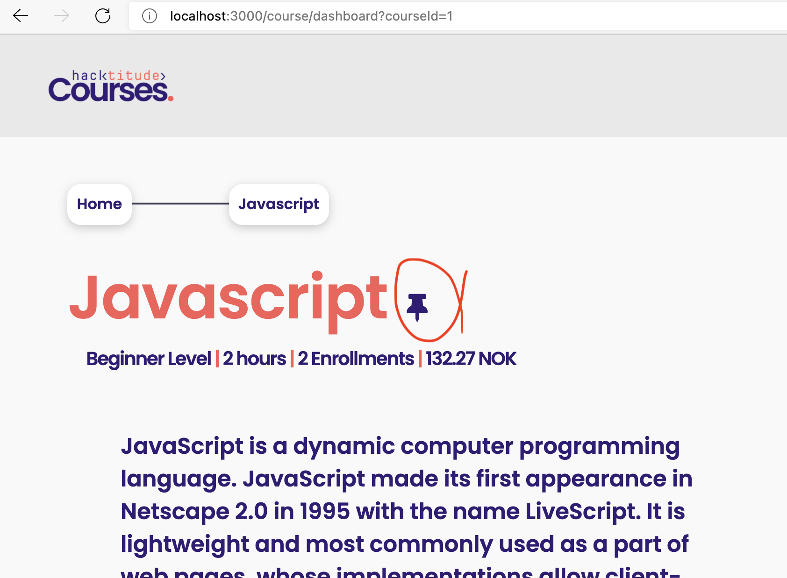

[<< home](./README.md)

# Challenge 12

After enrolling into a course, the user should be able to `pin` and `unpin` a course. This pinned state should be updated in the Database.

Once this task is complete, in the `Enrolled` section all the pinned courses should have a pin icon displayed in the card as below.

## Challenge 12.a [1 Point]

Changing the `pinned` state of a course should be done though the course dashboard page. 

Currently, the pin button is shown for all the courses in the `course-dashboard.ejs` page regardless if the user has enrolled or not. You have to fix this and render the element with id `pin` only when the user is enrolled to the particular course.

>> NOTE: Use EJS server scripts to not render this element.

## Challenge 12.b [1 Point]

When the pin icon is clicked, the `userCourses` table has to be updated by toggling the pinned state. 

To implement this, you have to add a new column called `pinned` in `userCourses` which should accept boolean (or 1 and 0) values.

>>HINT: Always use `migrate` files to do DB changes. In `createTable()`statement of the migration file, you can create a boolean column with statement `table.boolean("pinned")`.

## Challenge 12.c [6 Points]

On course dashboard, when the pin icon is clicked, `pinned` should be toggled in the database. Use `/course/pin` route in `courseController.js` to implement this and write the necessary logic to accomplish this.

## Challenge 12.d [1 Point]

Now you need to change the `Enrolled` page so that users are able to see the pinned state of the listed courses.

In `enrolled.ejs`, only the courses that are pinned should render the element starting with id `pin-`. If a course is not pinned, then the element should not be rendered.

>> NOTE: Use EJS server scripts to not render this element.
