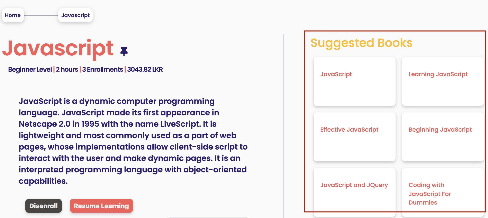

[<< home](./README.md)

# Challenge 13

As shown above, in course dashboard page, your task is to display 5 books that are related to this course.

## Challenge 13.a [4 Points]

In `course-dashboard.ejs`, 5 Suggested Books related to the `title` of the course should be shown inside the div which has the id `suggested-books-container`.

The books should be fetched from `Google Books API` - `https://developers.google.com/books`

You should refer the Google Books API documentation and fetch 5 books related to the course. In finding the related books, you should use the `first word` in the `course title` and query the Google API to return books containing that `first word` in each returned book's title.

E.g. If the course title is "OOP Concepts", all displayed books should have the word "OOP" in the title of the book.

>> Note: Your team will have to obtain a google API key to call their APIs.

The html element with the class `book-card` inside the `suggested-books-container` should iteratively be populated with the names of the 5 books returned from the Google APIs.
