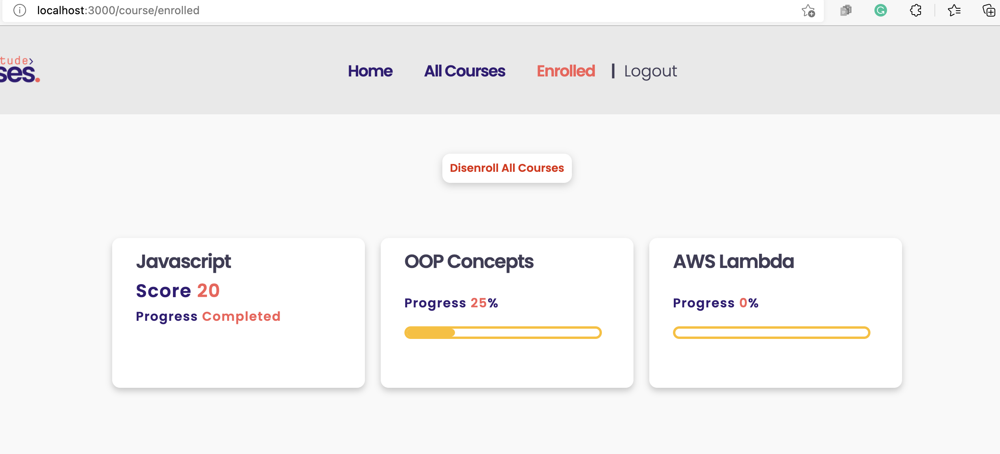

[<< home](./README.md)

# Challenge 14

In this challenge you are required to implement a progress completion indicator for a particular course. User's progress should be shown on courses displayed in the `Enrolled` page.

Progressed is calculated and recorded when user marking `course chapter` as done. `Mark as Done` buttons shown in the below page should be used for this.

For example, on every chapter completion, you may increase the progress by 25. Since every course has 3 chapters, when the user mark all 3 chapters as done, course progress will be 75. Once the user submits the assessment, course progress is to be shown as `Completed`.

## Challenge 14.a [1 Point]

When an user progress through a particular course, completion % should be updated in the `userCourses` table. To keep this information you must create a new column named `progress` in `userCourses` table. This column should be of type `integer`.

>> Note: Always use `migration` files to make db changes.

## Challenge 14.b [4 Points]

In `course-page.ejs`, when the user click on the buttons which has the ids `btnChapterOne`, `btnChapterTwo` and `btnChapterThree`, the progress % must be updated in the database using the `/course/updateProgress/${courseId}/${progress}` route.

Now to show the each course progress under `Enrolled` page, modify the `enrolled.ejs` file as follows.

* The value of `<progress>` element should show the progress value fetched from the database.
* The text within span element with id starting with `progress-text-` should show the progress value.

Once completed, every course in `Enrolled` page should show progress as follows.

