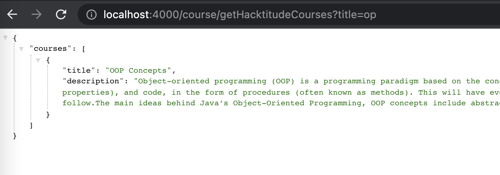

[<< home](./README.md)

# Challenge 15

Your task is to create a publicly accessible REST API to get the courses which are available in the system.

REST Endpoint - `http://<server-ip>:<port>/course/getHacktitudeCourses`
HTTP Method   -  `GET`

For example, when the server is up in local machine, `http://localhost:3000/course/getHacktitudeCourses` URL should return the results in the following format.

```json
{
    "courses":[
        {
            "title":"AWS Lambda",
            "description":"AWS Lambda is a serverless..."
        },
        {
            "title":"DotNET Basics",
            "description":".NET is a free cross-platform, o..."
        }
    ]
}
```

## Challenge 15.a [4 Points]

Implement the endpoint `/course/getHacktitudeCourses` such that without passing any parameter, all the available courses are returned. JSON format should be as shown above (title and description must be returned).

## Challenge 15.b [1 Point]

Implement an optional parameter `maxResults` which can be used to limit the number of results returned by the API.

For example `?maxResults=3`; only 3 courses should be returned.

## Challenge 15.c [1 Point]

When the optional parameter `title` is passed, for example `?title=op`; the courses which its title has the term `op` anywhere in the title `(contained)` should be returned.


