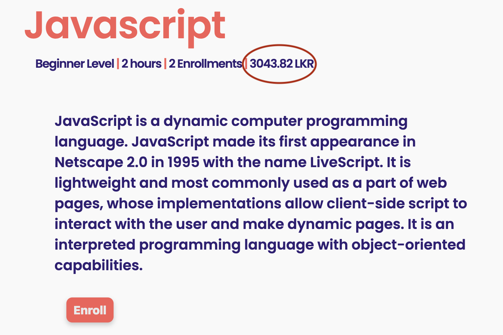

[<< home](./README.md)

# Challenge 17

Currently through the `db seed` files you can see that every user has their preferred currency in `country_currency` column of the `users` table. When a new user is signed up, the default currency of `LKR` is set for the user.

You may also note that, in every `course` record in teh database has a `price` column. The price value stored in the database is in USD.

## Challenge 17.a [6 Points]

Your task is to show the course price under `course dashboard` page as shown below:

However you can't simply display the USD value from database. You must convert the USD value to the users's preferred currency.

To do the currency conversion use the APIs from - `https://openexchangerates.org/`.

>> Note: Use the freely available endpoints to do the implementation. You do not require paid features.

>>You will be required to obtain a API key in doing this.

>>Under the free subscription of this API, you are given a limited number of API calls. If you run out of the free API calls quota, obtain an another API key. When you submit the final code you need to have at least 100 more calls available in your API key quota.

The conversion should happen according to the conversion rate as of the first day of the current month. For example if the current month in January. 2022, the conversion rate as of `1st of January, 2022` should be used.

The converted price should be displayed by rounding to two decimal points inside the span element with id `course-price` in `course-dashboard.ejs` file.
