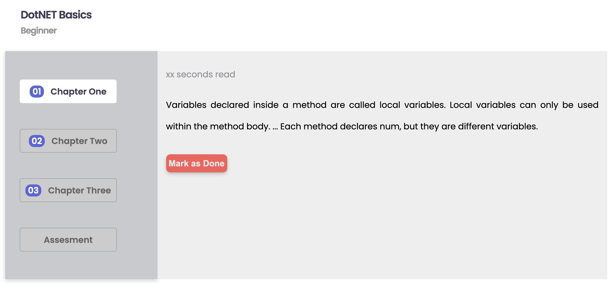
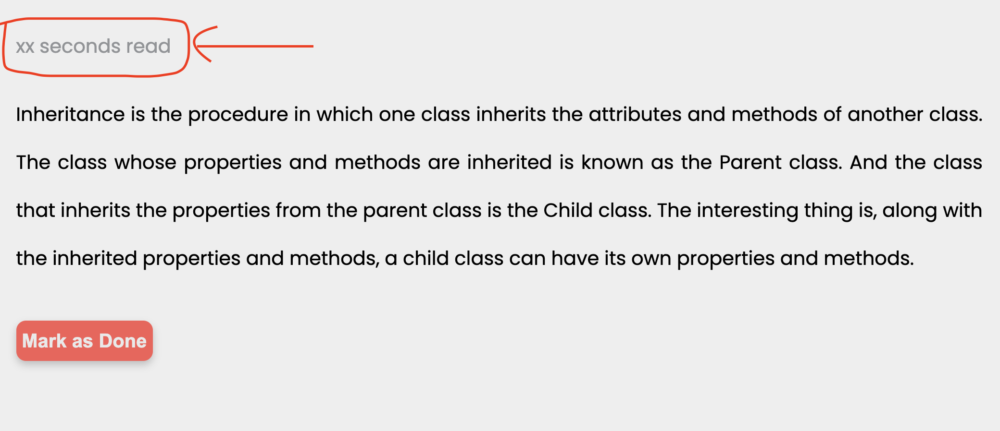
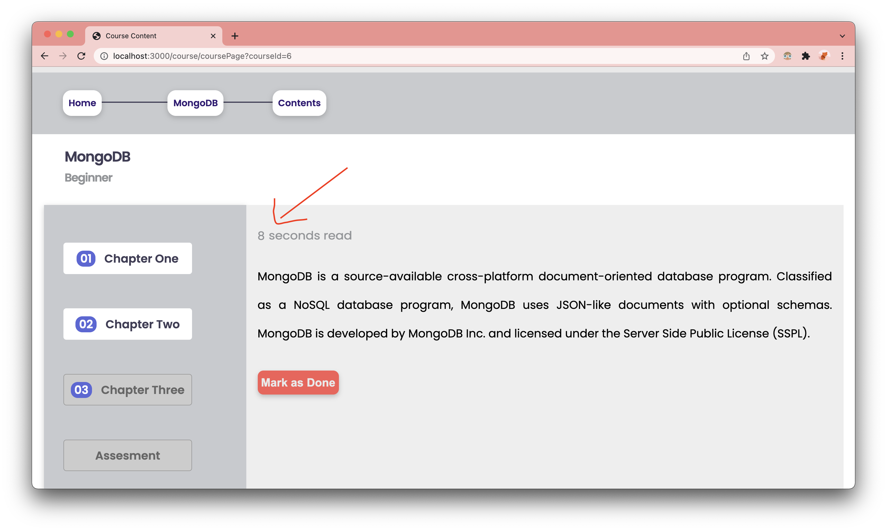
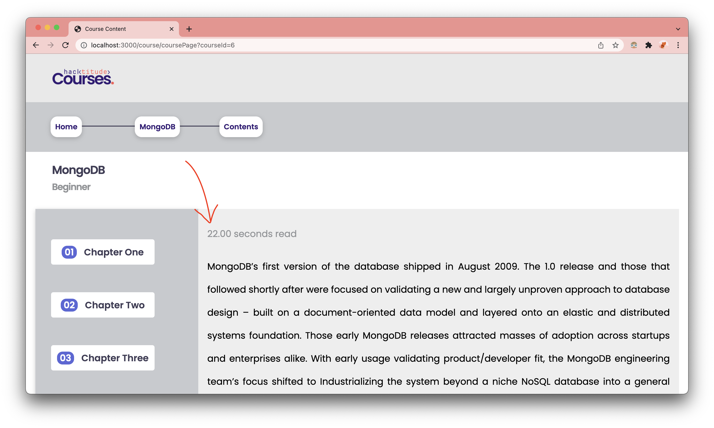

[<< home](./README.md)

# Challenge 18

After enrolling to a course, when the user resumes learning, user will get redirected to `course-page.ejs` where they will get to read the contents of the course. Every course has 3 chapters. After reading all 3 chapters, the user will be able to attempt the MCQ Assessment.

Under each chapter content, the predicted read time should be displayed. Currently this is NOT implemented. System just shows as `xx seconds read` under all the chapters.

In this challenge, your task is to calculate and display the predicted read time in seconds according to below criteria.

For all chapters `read time` should be calculated as below:

`read_time = (word_count_of_the_content)/(words_per_second)`

However, different chapters have a different `words_per_second` values.

CHAPTER 1 - Here, the value of `words_per_second` should be taken as `4`.

CHAPTER 2 - For this chapter we assume user's `words per second` has increased by 5% compared to the CHAPTER 1.

CHAPTER 3 - For this chapter we assume user's `words per second` has increased by 5% compared to the CHAPTER 2.

## Challenge 18.a [6 Points]

Your task is to calculate the `read time` in seconds and to display by **rounding to the nearest integer** in `course-page.ejs`.

Respective `read times` should be displayed in the `` elements having ids `read-time-1` , `read-time-2` and `read-time-3`.

The final implementation should look as follows,

