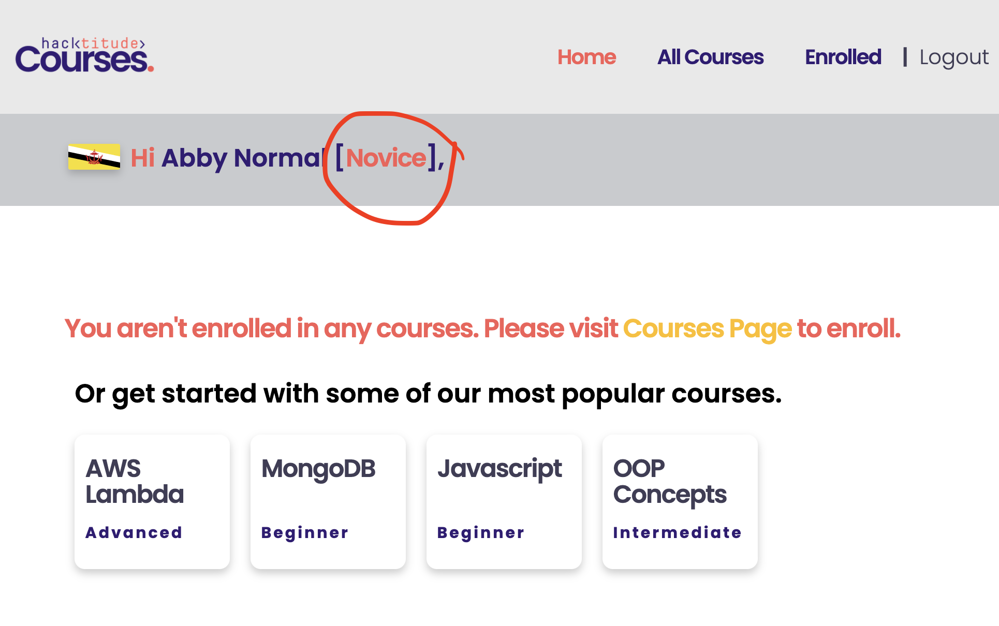
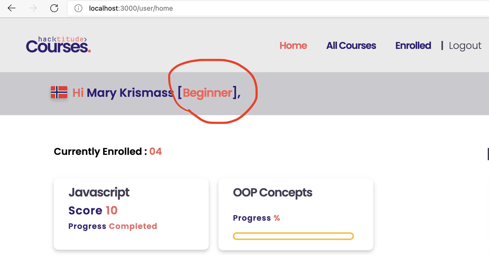

[<< home](./README.md)

# Challenge 2

When an user sign in to the application, you should show the `grade` of that user depending on their learning status.

Under this task you should implement the required functionality to calculate user grade and to display it.

Below images show examples of such grading for 2 different users.

| Novice    | Beginner |
| ----------- | ----------- |
|       |        |

This user grade tag should be displayed inside the span element with id `user-grade` in `home.ejs`.

The available grades are `Novice, Beginner, Expert` in the order of lowest to the highest grade.

The criteria (algorithms) of grading are described under below sub tasks. If an user qualify for more than one grade, user should be awarded the highest applicable grade.

## Challenge 2.a [3 Points]

Implement the necessary logic to award `Novice` grade based on the following criteria.

`Novice` -> If the user is enrolled in 2 or less courses, then he/she has to be graded as a `Novice`.

## Challenge 2.b [3 Points]

Implement the necessary logic to award `Beginner` grade based on the following criteria.

`Beginner` -> If a user is enrolled in more than 2 courses OR has completed at least a single course, then that particular user should be graded as a `Beginner`.

## Challenge 2.c [3 Points]

Implement the necessary logic to award `Expert` grade based on the following criteria.

`Expert` -> If a user has an cumulative score of more than 90 (score in total for all completed courses), that user should be graded as an `Expert`.
