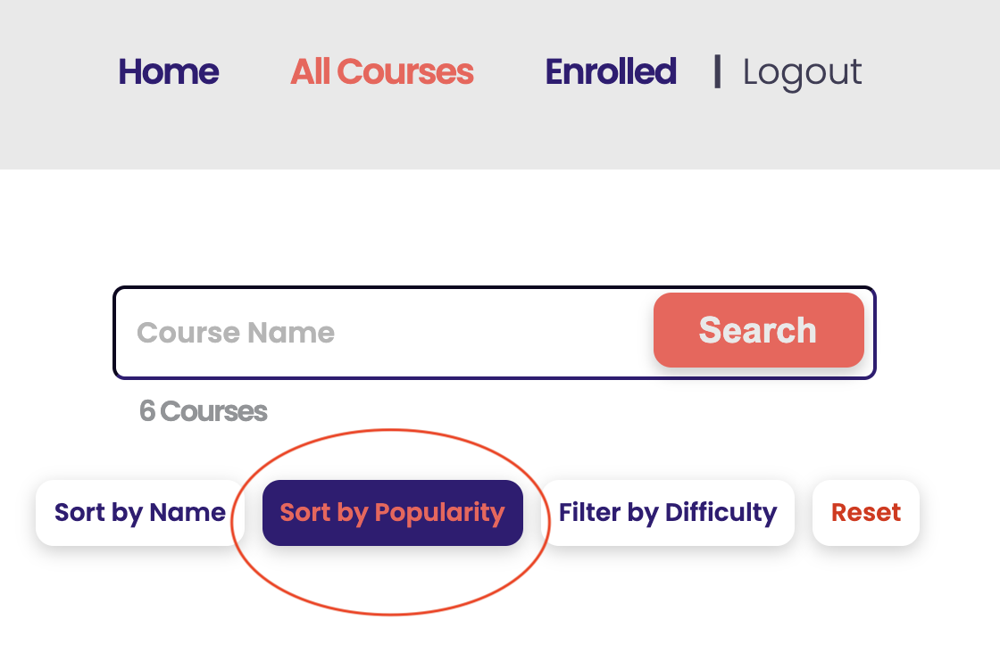
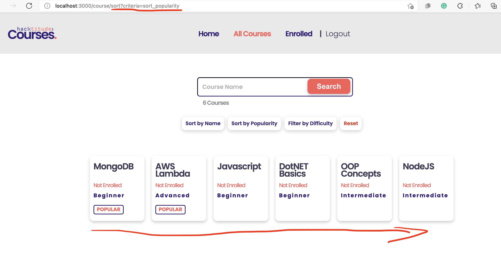

[<< home](./README.md)

# Challenge 4

In the `all courses` page, currently sorting is available only by `course-name`. However, sorting functionality should be available by course `popularity` too.

Popularity of a course is determined by the number of users enrolled to the course. Courses with higher number of enrollments are of higher popularity. In case more than one course have the same number of enrollments, those should be ordered alphabetically in ascending order.

## Challenge 4.a [1 Point]

Your task is to develop functionality so that users can sort the courses by popularity as below.

This functionality requires a  'sort by popularity' button in `all-courses.ejs` as shown above. (The button with id `sort-by-popularity` is currently hidden. Make sure you un hide it). Once you un hide this button, one additional test will succeed.

## Challenge 4.b [6 Points]

Now you should no implement functionality so that when the Button is clicked, courses are sorted by popularity in the descending order as shown below.

You will notice that when the button is clicked it sends the HTTP GET request `/course/sort?criteria=sort_popularity` to the `courseController.js`. You will require to change the sorting logic in the server scripts to accommodate sorting by popularity upon above GET request.

>>Note: In this implementation you must ensure you keep `/course/sort?criteria=sort_popularity` endpoint, but change the internal implementation accordingly.

Once done, the system should be able to sort the courses by popularity as shown below.

