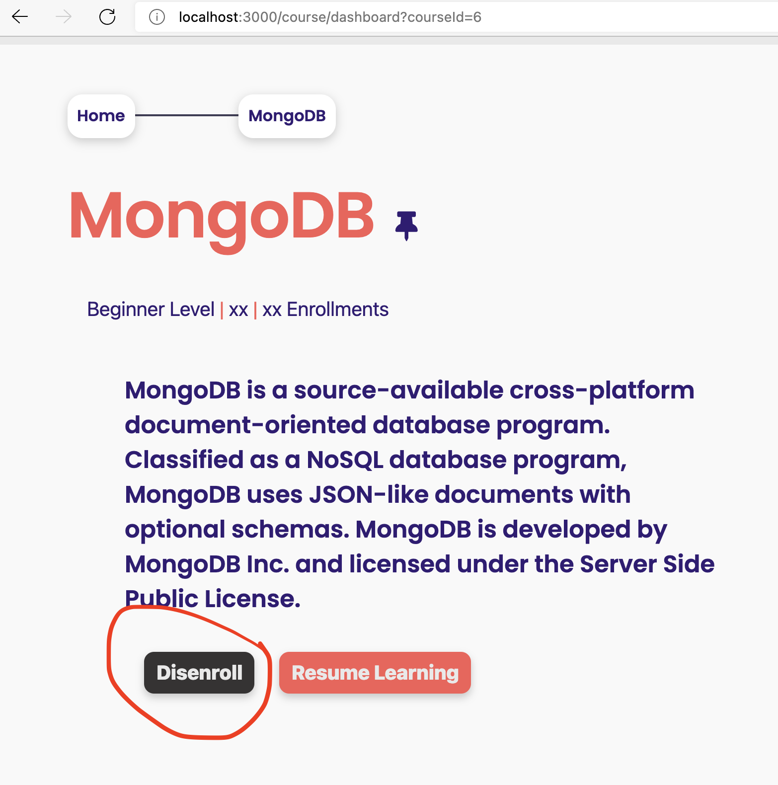

[<< home](./README.md)

# Challenge 5

Currently the system has `Disenroll All Courses` functionality on `Enrolled` courses page as shown below. When an user click this, he/she is disenrolled from **all** currently enrolled courses.

However, there is no way to disenroll a course individual basis. Your task is to implement this functionality.

## Challenge 5.a [1 Point]

You may notice that `course-dashboard.ejs` containing a hidden button with id `dis-enroll-btn`. You should unhide this button, so that it can be used to implement this functionality.

Unhiding the button will pass 1 related test case.

## Challenge 5.b [3 Points]

When this Button is clicked, you may notice that it sends a HTTP GET request `/course/disenroll?courseId=1`. There is a skeleton (incomplete) method available to receive this request in `courseController.js`.

Your task is to implement the required logic and functionality to disenroll the current user upon click of the button. You should NOT change the HTTP request signature `/course/disenroll?courseId=1` in completing this task.

>> HINT: This task involves relevant association record deletion in `userCourses` table in the database when user clicks the button.

When this task is implemented, users will be able to disenroll themselves from a course on individual basis.
