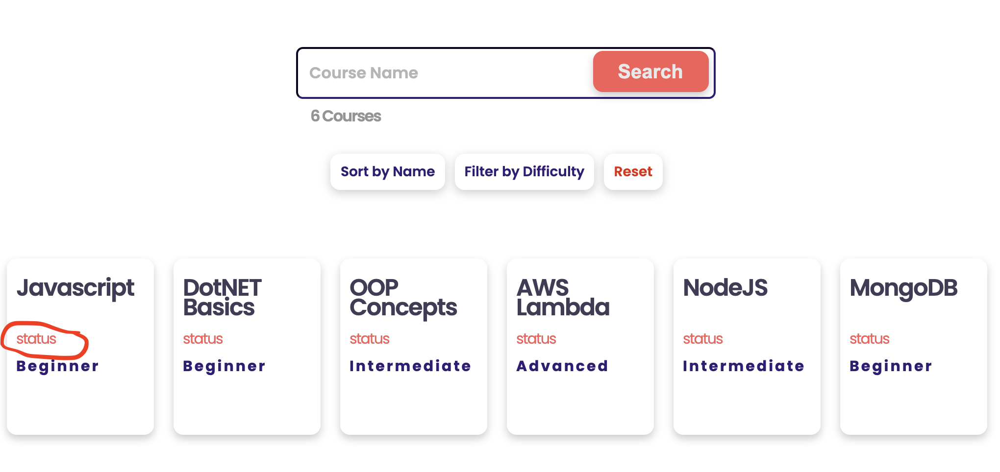
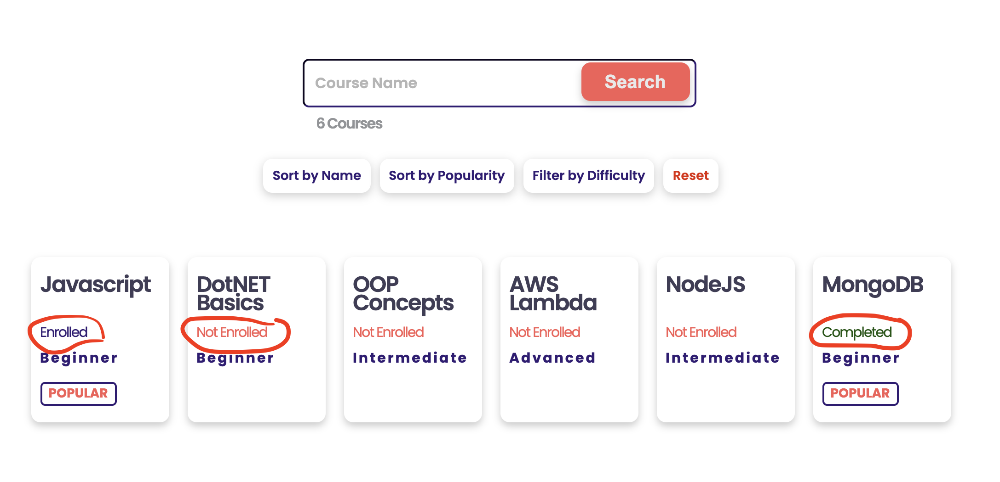

[<< home](./README.md)

# Challenge 6

When you visit `All Courses` page you may notice that every course contains a dummy text `status`.

This placeholder text is supposed to indicate the logged in user's status for the particular course. Currently `status` text is hard coded in an span element having a id starting with `course-status-` in `all-courses.ejs` file.

## Challenge 6.a [6 Points]

Your task is to make that status text to dynamically reflect the enrollment status. That is, instead of text `status`, you should display suggested texts for below scenarios.

* If the user is already enrolled to the course (`userCourses` table has an association record), text should be shown as: `Enrolled`
* If the user has not enrolled to the course (`userCourses` table has no association record), text should be shown as: `Not Enrolled`
* If the user has completed the course (`userCourses` table has an association record and `userCourses.score` is not `-1`), text should be shown as: `Completed`

>>Note: You should be careful not to change the dynamic element id generation logic `id="course-status-<%= allcourses[i].id %>"` while you implement this feature.

Once correctly implemented, the solution should look as following.

Once this task is complete 2 test cases should succeed in `challenge-6.test.js`.
