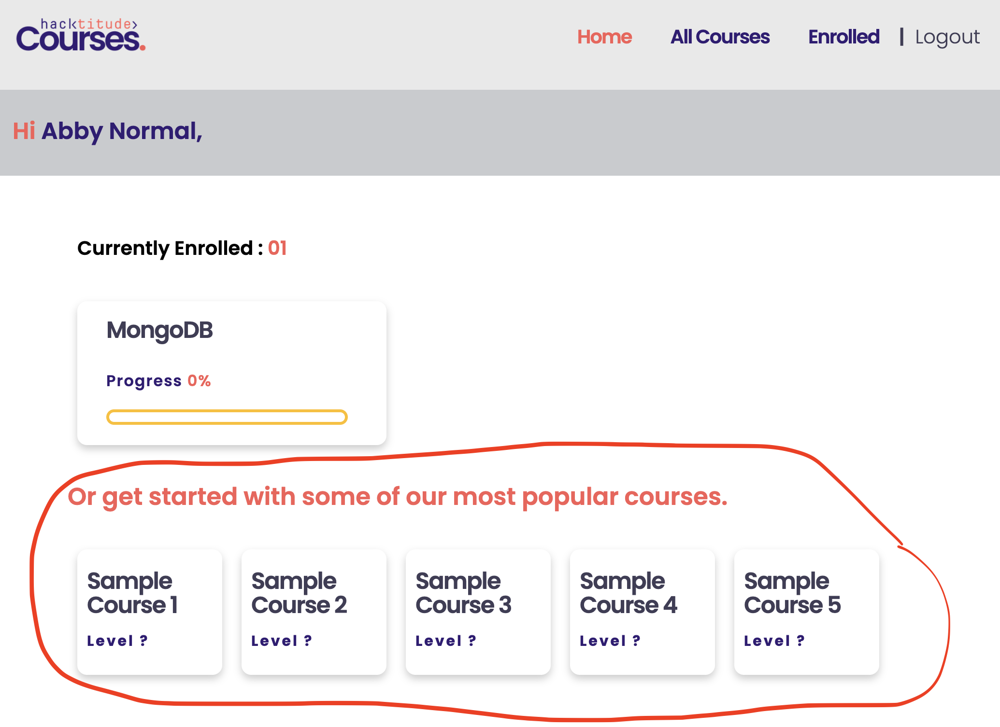

[<< home](./README.md)

# Challenge 7

Popularity of a course is determined by the number of users enrolled to the course. Courses with higher number of enrollments are of higher popularity. In case, more than one course have the same number of enrollments, those should be ordered alphabetically in ascending order.

## Challenge 7.a [1 Point]

As shown above, the `home` page shows popular courses currently for every user. This is a bug in the application.

The popular courses (i.e element with id `popular-courses`) should only be shown to users who are not enrolled to any course. If the user has enrolled courses, this section should not be rendered in the DOM. Your task is to only show this section when user has no enrolled courses.

>> Note: You should use EJS (not JavaScript) in accomplishing this as the DOM should not contain this section for users who are enrolled to courses.

Once done, html element with id `popular-courses` will not be available for users having enrolled courses as shown below.

| User with no enrolled courses    | User with enrolled courses |
| ----------- | ----------- |
|       |        |

One additional test will pass when you complete this task.

## Challenge 7.b [4 Points]

You may notice that the 5 most popular courses shown in this section are currently hardcoded inside the div with id `popular-courses`.

Your task is to correctly implement this by fetching the 5 most popular courses from the database and displaying as shown below.

