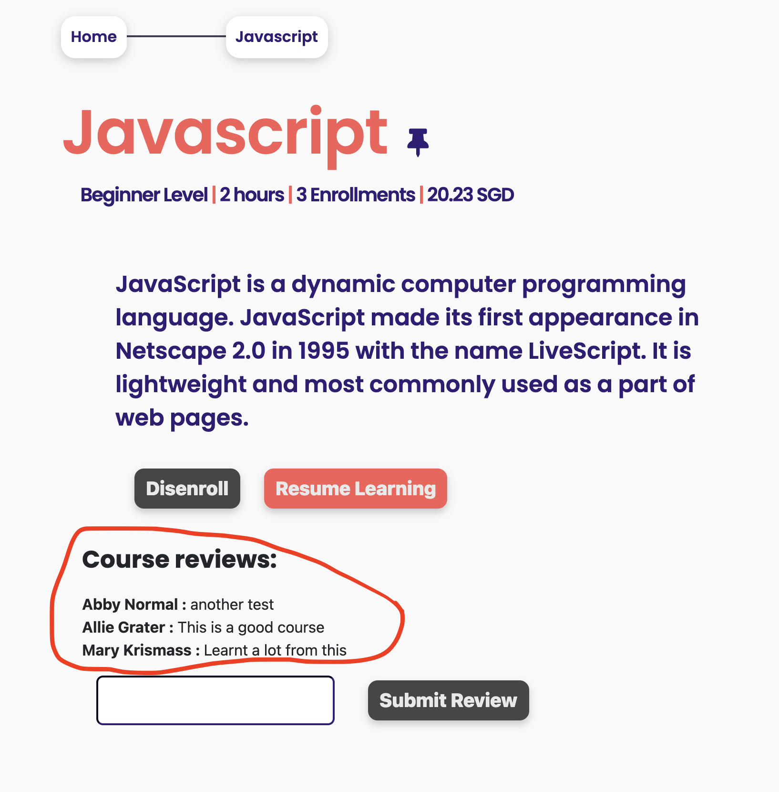

[<< home](./README.md)

# Challenge 8

Course dashboard page should provide functionality for users to enter a `review` about the course. These reviews should also be displayed on the course dashboard page. Follow below steps to complete this challenge.

## Challenge 8.a [1 Point]

Currently the div with id `comments-container` in `course-dashboard.ejs` is hidden. You need to unhide this.

You may also notice that there is a form with id `course-review-form` within the above div. This form should be rendered only if the logged in user has enrolled for this course. If this user is not enrolled, this form should not be rendered in the DOM.

>> Note: You have to use EJS server-side scripting (not client side) to ensure the form is not rendered on DOM for unenrolled users.

| Not enrolled user    | Enrolled user |
| ----------- | ----------- |
|       |        |

## Challenge 8.b [1 Point]

The div `comments-container` should display all the reviews given by users. Each review should display reviewer's name and the review text.

In order to accomplish this, you should add a new column `review` to the `userCourses` database table. Reviews entered by users should be stored in this new `review` cell of the relevant row.

>> Changing database schema should be done only through `migration` files as you have practiced in `challenge-0`.

For now you can change the db `seed` file to add some reviews for testing purposes. Once you add few sample reviews through seed data, those courses should show  reviews as follows.

## Challenge 8.c [10 Points]

Under this task you should complete the functionality for users to submit a review through the user interface.

Reviews are entered by submitting `course-review-form` in `course-dashboard.ejs`. The form submits the entered review to an HTTP POST end point in `courseController.js`.

>>Note: Do NOT change the format or parameters of this HTTP POST end point `/course/review/:cid`

You may also observe that this functionality is not yet implemented. You should complete this functionality so that, users are able to post reviews through the user interface. Reviews should be saved to the new `review` column in `userCourses` table.

If an user submits more than one review to a particular course, the previous review should be overridden with the latest.
