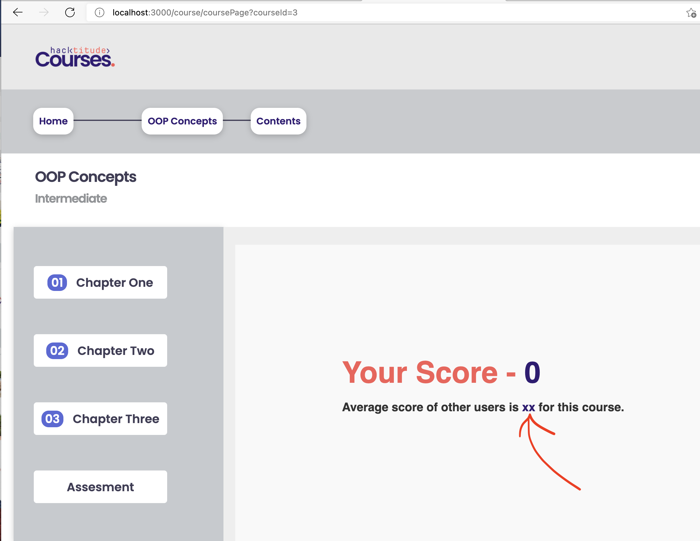
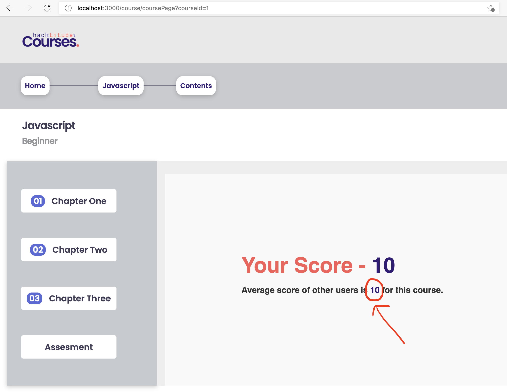

[<< home](./README.md)

# Challenge 9

In the current solution, an enrolled user can navigate through the chapters of the course to read content. You may also notice that at the end of chapters, there is an assessment for the users to submit.

## Challenge 9.a [6 Points]

When the user submits an assessment, the user's score is calculated and shown. This functionality is already existing in the solution.

Together with user's score, the `average score` of other users who completed the same course previously should be displayed instead of `xx` placeholder (see below). This is the functionality you should implement under this task.

  

Calculate the average score of all users who `COMPLETED` the course `PREVIOUSLY` and display it in the span tag which has the id `average-score` in `scores.ejs`. Also please note that the average Score shown should be rounded to the nearest integer.

Once completed, you should see average score as shown below.

  
